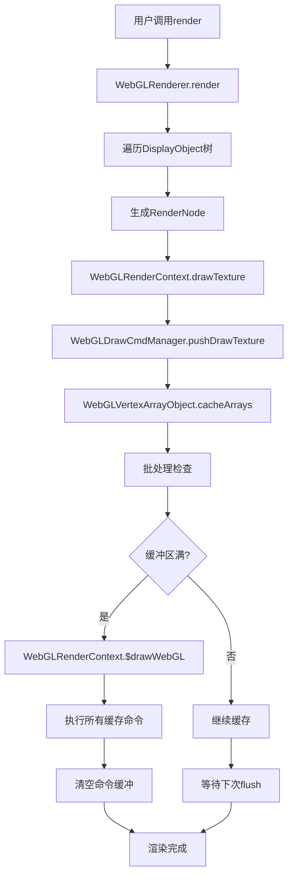
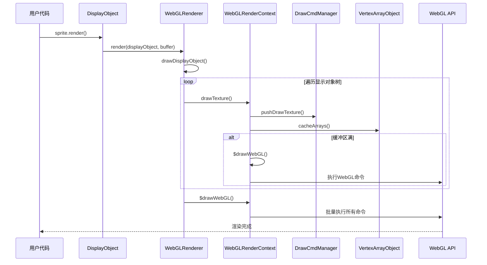
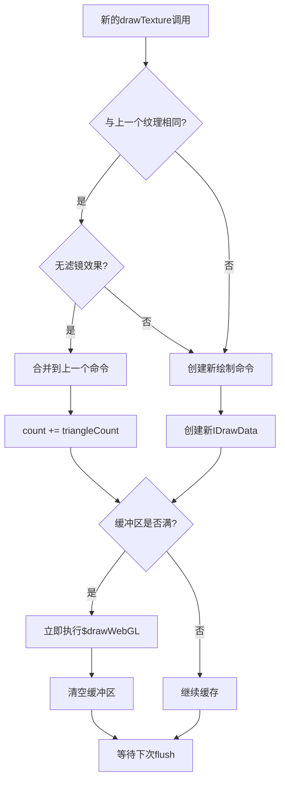

# 白鹭引擎 OpenGL/WebGL 封装流程深度剖析

## 概述

本文档深入解析白鹭引擎如何使用和封装OpenGL（WebGL），详细分析从用户API调用到底层OpenGL指令的完整流程，探讨其设计理念、优化策略和实现细节。

## 目录

1. [整体架构与设计理念](#整体架构与设计理念)
2. [OpenGL使用流程详解](#OpenGL使用流程详解)
3. [核心组件深度分析](#核心组件深度分析)
4. [渲染管线完整流程](#渲染管线完整流程)
5. [着色器系统详解](#着色器系统详解)
6. [批处理优化机制](#批处理优化机制)
7. [性能优化策略](#性能优化策略)
8. [为什么这样封装](#为什么这样封装)

---

## 整体架构与设计理念

### 架构层次

白鹭引擎的OpenGL封装采用分层设计，每层都有明确的职责：

```
┌─────────────────────────────────────────────┐
│  用户层 (DisplayObject, Sprite, Bitmap)      │  ← 游戏开发者接触层
├─────────────────────────────────────────────┤
│  显示列表 (DisplayList, RenderNode)          │  ← 显示对象转换层
├─────────────────────────────────────────────┤
│  渲染器 (WebGLRenderer)                     │  ← 渲染逻辑协调层
├─────────────────────────────────────────────┤
│  渲染上下文 (WebGLRenderContext)             │  ← OpenGL状态管理层
├─────────────────────────────────────────────┤
│  命令管理器 (WebGLDrawCmdManager)           │  ← 绘制命令缓存层
├─────────────────────────────────────────────┤
│  顶点管理器 (WebGLVertexArrayObject)        │  ← 顶点数据管理层
├─────────────────────────────────────────────┤
│  WebGL API                                 │  ← 浏览器原生API
└─────────────────────────────────────────────┘
```

### 设计理念

#### 1. 延迟渲染 (Deferred Rendering)
- **核心思想**: 不立即执行OpenGL调用，而是缓存命令
- **优势**: 减少状态切换，支持批处理优化
- **实现**: 通过WebGLDrawCmdManager缓存所有绘制命令

#### 2. 状态最小化切换
- **原理**: OpenGL状态切换开销大，尽量复用相同状态
- **策略**: 按纹理、着色器、混合模式等分组绘制
- **效果**: 显著减少draw call数量

#### 3. 资源池化管理
- **目的**: 避免频繁的内存分配和释放
- **应用**: RenderBuffer对象池、着色器程序缓存
- **实现**: 静态缓存和重用机制

---

## OpenGL使用流程详解

### 完整渲染流程图



### 详细步骤分析

#### 第一阶段：渲染请求处理

**文件**: `src/egret/web/rendering/webgl/WebGLRenderer.ts:60`

```typescript
public render(displayObject: DisplayObject, buffer: sys.RenderBuffer, 
              matrix: Matrix, forRenderTexture?: boolean): number {
    this.nestLevel++;  // 嵌套层级管理
    let webglBuffer: WebGLRenderBuffer = <WebGLRenderBuffer>buffer;
    let webglBufferContext: WebGLRenderContext = webglBuffer.context;

    // 1. 推入渲染缓冲栈
    webglBufferContext.pushBuffer(webglBuffer);

    // 2. 应用变换矩阵
    webglBuffer.transform(matrix.a, matrix.b, matrix.c, matrix.d, 0, 0);
    
    // 3. 递归绘制显示对象树
    this.drawDisplayObject(displayObject, webglBuffer, matrix.tx, matrix.ty, true);
    
    // 4. 执行所有缓存的WebGL命令
    webglBufferContext.$drawWebGL();
    
    // 5. 获取draw call统计
    let drawCall = webglBuffer.$drawCalls;
    
    // 6. 清理和恢复状态
    webglBuffer.onRenderFinish();
    webglBufferContext.popBuffer();
    
    this.nestLevel--;
    return drawCall;
}
```

#### 第二阶段：显示对象递归处理

**关键逻辑**: `WebGLRenderer.ts:99-227`

```typescript
private drawDisplayObject(displayObject: DisplayObject, buffer: WebGLRenderBuffer, 
                          offsetX: number, offsetY: number, isStage?: boolean): number {
    let drawCalls = 0;
    let node: sys.RenderNode;
    
    // 1. 获取或创建渲染节点
    if (displayObject.$renderDirty) {
        node = displayObject.$getRenderNode();
    } else {
        node = displayObject.$renderNode;
    }
    
    // 2. 根据节点类型分发渲染
    if (node) {
        drawCalls++;
        buffer.$offsetX = offsetX;
        buffer.$offsetY = offsetY;
        
        switch (node.type) {
            case sys.RenderNodeType.BitmapNode:
                this.renderBitmap(<sys.BitmapNode>node, buffer);
                break;
            case sys.RenderNodeType.TextNode:
                this.renderText(<sys.TextNode>node, buffer);
                break;
            case sys.RenderNodeType.GraphicsNode:
                this.renderGraphics(<sys.GraphicsNode>node, buffer);
                break;
            case sys.RenderNodeType.MeshNode:
                this.renderMesh(<sys.MeshNode>node, buffer);
                break;
        }
    }
    
    // 3. 递归处理子对象
    let children = displayObject.$children;
    if (children) {
        for (let i = 0; i < children.length; i++) {
            let child = children[i];
            
            // 应用子对象的alpha和tint
            if (child.$alpha != 1) {
                let tempAlpha = buffer.globalAlpha;
                buffer.globalAlpha *= child.$alpha;
            }
            
            // 递归渲染子对象
            drawCalls += this.drawDisplayObject(child, buffer, newOffsetX, newOffsetY);
        }
    }
    
    return drawCalls;
}
```

#### 第三阶段：纹理绘制命令生成

**文件**: `src/egret/web/rendering/webgl/WebGLRenderContext.ts:640`

```typescript
public drawImage(image: BitmapData,
    sourceX: number, sourceY: number, sourceWidth: number, sourceHeight: number,
    destX: number, destY: number, destWidth: number, destHeight: number,
    imageSourceWidth: number, imageSourceHeight: number, 
    rotated: boolean, smoothing?: boolean): void {
    
    let buffer = this.currentBuffer;
    if (this.contextLost || !image || !buffer) {
        return;
    }

    // 1. 获取或创建WebGL纹理
    let texture: WebGLTexture = this.getWebGLTexture(image);
    if (!texture) {
        return;
    }

    // 2. 调用底层纹理绘制
    this.drawTexture(texture,
        sourceX, sourceY, sourceWidth, sourceHeight,
        destX, destY, destWidth, destHeight,
        imageSourceWidth, imageSourceHeight,
        undefined, undefined, undefined, undefined, rotated, smoothing);
}
```

#### 第四阶段：顶点数据缓存

**文件**: `src/egret/web/rendering/webgl/WebGLRenderContext.ts:733`

```typescript
public drawTexture(texture: WebGLTexture,
    sourceX: number, sourceY: number, sourceWidth: number, sourceHeight: number,
    destX: number, destY: number, destWidth: number, destHeight: number, 
    textureWidth: number, textureHeight: number,
    meshUVs?: number[], meshVertices?: number[], meshIndices?: number[], 
    bounds?: Rectangle, rotated?: boolean, smoothing?: boolean): void {
    
    let buffer = this.currentBuffer;
    if (this.contextLost || !texture || !buffer) {
        return;
    }

    // 1. 检查缓冲区是否需要flush
    if (meshVertices && meshIndices) {
        if (this.vao.reachMaxSize(meshVertices.length / 2, meshIndices.length)) {
            this.$drawWebGL();  // 立即执行绘制
        }
    } else {
        if (this.vao.reachMaxSize()) {  // 默认4顶点6索引的quad
            this.$drawWebGL();
        }
    }

    // 2. 处理纹理平滑度设置
    if (smoothing != undefined && texture["smoothing"] != smoothing) {
        this.drawCmdManager.pushChangeSmoothing(texture, smoothing);
    }

    // 3. 生成绘制命令
    let count = meshIndices ? meshIndices.length / 3 : 2;  // 三角形数量
    this.drawCmdManager.pushDrawTexture(texture, count, this.$filter, textureWidth, textureHeight);
    
    // 4. 缓存顶点数据
    buffer.currentTexture = texture;
    this.vao.cacheArrays(buffer, sourceX, sourceY, sourceWidth, sourceHeight,
        destX, destY, destWidth, destHeight, textureWidth, textureHeight,
        meshUVs, meshVertices, meshIndices, rotated);
}
```

#### 第五阶段：命令缓存和批处理

**文件**: `src/egret/web/rendering/webgl/WebGLDrawCmdManager.ts:101`

```typescript
public pushDrawTexture(texture: any, count: number = 2, filter?: any, 
                      textureWidth?: number, textureHeight?: number): void {
    if (filter) {
        // 有滤镜效果时不合并绘制，单独处理
        let data = this.drawData[this.drawDataLen] || <IDrawData>{};
        data.type = DRAWABLE_TYPE.TEXTURE;
        data.texture = texture;
        data.filter = filter;
        data.count = count;
        data.textureWidth = textureWidth;
        data.textureHeight = textureHeight;
        this.drawData[this.drawDataLen] = data;
        this.drawDataLen++;
    } else {
        // 检查是否可以与上一个命令合并
        if (this.drawDataLen == 0 || 
            this.drawData[this.drawDataLen - 1].type != DRAWABLE_TYPE.TEXTURE ||
            texture != this.drawData[this.drawDataLen - 1].texture || 
            this.drawData[this.drawDataLen - 1].filter) {
            
            // 创建新的绘制命令
            let data = this.drawData[this.drawDataLen] || <IDrawData>{};
            data.type = DRAWABLE_TYPE.TEXTURE;
            data.texture = texture;
            data.count = 0;
            this.drawData[this.drawDataLen] = data;
            this.drawDataLen++;
        }
        
        // 累加到现有命令的计数中（批处理核心）
        this.drawData[this.drawDataLen - 1].count += count;
    }
}
```

#### 第六阶段：顶点数据组装

**文件**: `src/egret/web/rendering/webgl/WebGLVertexArrayObject.ts:166`

```typescript
public cacheArrays(buffer: WebGLRenderBuffer, 
    sourceX: number, sourceY: number, sourceWidth: number, sourceHeight: number,
    destX: number, destY: number, destWidth: number, destHeight: number, 
    textureSourceWidth: number, textureSourceHeight: number,
    meshUVs?: number[], meshVertices?: number[], meshIndices?: number[], 
    rotated?: boolean): void {
    
    // 1. 计算全局透明度和tint颜色
    let alpha = buffer.globalAlpha;
    alpha = Math.min(alpha, 1.0);
    const globalTintColor = buffer.globalTintColor || 0xFFFFFF;
    
    // 2. 获取全局变换矩阵
    let locWorldTransform = buffer.globalMatrix;
    let a = locWorldTransform.a, b = locWorldTransform.b;
    let c = locWorldTransform.c, d = locWorldTransform.d;
    let tx = locWorldTransform.tx, ty = locWorldTransform.ty;

    // 3. 应用偏移量
    let offsetX = buffer.$offsetX, offsetY = buffer.$offsetY;
    if (offsetX != 0 || offsetY != 0) {
        tx = offsetX * a + offsetY * c + tx;
        ty = offsetX * b + offsetY * d + ty;
    }

    if (!meshVertices) {
        // 4. 标准四边形处理
        if (destX != 0 || destY != 0) {
            tx = destX * a + destY * c + tx;
            ty = destX * b + destY * d + ty;
        }

        // 5. 应用缩放
        let a1 = destWidth / sourceWidth;
        let d1 = destHeight / sourceHeight;
        if (a1 != 1) { a = a1 * a; b = a1 * b; }
        if (d1 != 1) { c = d1 * c; d = d1 * d; }

        // 6. 计算纹理坐标
        let width = textureSourceWidth;
        let height = textureSourceHeight;
        let w = sourceWidth, h = sourceHeight;
        sourceX = sourceX / width;
        sourceY = sourceY / height;
        
        let vertices = this.vertices;
        const verticesUint32View = this._verticesUint32View;
        let index = this.vertexIndex * this.vertSize;

        if (rotated) {
            // 处理旋转纹理的情况
            let temp = sourceWidth;
            sourceWidth = sourceHeight / width;
            sourceHeight = temp / height;
            // ... 填充旋转后的顶点数据
        } else {
            // 7. 填充四个顶点的数据 (x, y, u, v, color)
            sourceWidth = sourceWidth / width;
            sourceHeight = sourceHeight / height;
            
            // 顶点0 (左上)
            vertices[index++] = tx;
            vertices[index++] = ty;
            vertices[index++] = sourceX;
            vertices[index++] = sourceY;
            verticesUint32View[index++] = alpha;
            
            // 顶点1 (右上)
            vertices[index++] = a * w + tx;
            vertices[index++] = b * w + ty;
            vertices[index++] = sourceWidth + sourceX;
            vertices[index++] = sourceY;
            verticesUint32View[index++] = alpha;
            
            // 顶点2 (右下)
            vertices[index++] = a * w + c * h + tx;
            vertices[index++] = d * h + b * w + ty;
            vertices[index++] = sourceWidth + sourceX;
            vertices[index++] = sourceHeight + sourceY;
            verticesUint32View[index++] = alpha;
            
            // 顶点3 (左下)
            vertices[index++] = c * h + tx;
            vertices[index++] = d * h + ty;
            vertices[index++] = sourceX;
            vertices[index++] = sourceHeight + sourceY;
            verticesUint32View[index++] = alpha;
        }

        // 8. 更新索引计数
        this.vertexIndex += 4;  // 添加了4个顶点
        this.indexIndex += 6;   // 添加了6个索引（2个三角形）
    } else {
        // 处理Mesh顶点数据...
    }
}
```

#### 第七阶段：WebGL命令执行

**文件**: `src/egret/web/rendering/webgl/WebGLRenderContext.ts:878`

```typescript
public $drawWebGL() {
    if (this.drawCmdManager.drawDataLen == 0 || this.contextLost) {
        return;
    }

    // 1. 获取顶点和索引数据
    const indices = this.vao.getIndices();
    const vertices = this.vao.getVertices();

    // 2. 上传顶点数据到GPU
    this.uploadVerticesArray(vertices);

    // 3. 处理Mesh索引
    if (this.vao.isMesh()) {
        this.uploadIndicesArray(this.vao.getMeshIndices());
    }

    // 4. 逐个执行缓存的绘制命令
    let length = this.drawCmdManager.drawDataLen;
    let offset = 0;
    for (let i = 0; i < length; i++) {
        let data = this.drawCmdManager.drawData[i];
        offset = this.drawData(data, offset);  // 执行单个命令
        
        // 5. 统计draw call
        let isDrawCall = data.type == DRAWABLE_TYPE.TEXTURE || 
                        data.type == DRAWABLE_TYPE.RECT || 
                        data.type == DRAWABLE_TYPE.PUSH_MASK || 
                        data.type == DRAWABLE_TYPE.POP_MASK;
        if (isDrawCall && this.activatedBuffer && this.activatedBuffer.$computeDrawCall) {
            this.activatedBuffer.$drawCalls++;
        }
    }

    // 6. 恢复默认索引
    if (this.vao.isMesh()) {
        this.uploadIndicesArray(this.vao.getIndices());
    }

    // 7. 清空缓存数据
    this.drawCmdManager.clear();
    this.vao.clear();
}
```

#### 第八阶段：具体绘制命令执行

**文件**: `src/egret/web/rendering/webgl/WebGLRenderContext.ts:938`

```typescript
private drawData(data: any, offset: number) {
    if (!data) return;

    let gl = this.context;
    let program: EgretWebGLProgram;
    let filter = data.filter;

    switch (data.type) {
        case DRAWABLE_TYPE.TEXTURE:
            // 1. 选择合适的着色器程序
            if (filter) {
                if (filter.type === "colorTransform") {
                    program = EgretWebGLProgram.getProgram(gl, 
                        EgretShaderLib.default_vert, 
                        EgretShaderLib.colorTransform_frag, 
                        "colorTransform");
                } else if (filter.type === "blur") {
                    program = EgretWebGLProgram.getProgram(gl,
                        EgretShaderLib.default_vert,
                        EgretShaderLib.blur_frag,
                        "blur");
                }
                // ... 其他滤镜类型
            } else {
                // 普通纹理渲染
                program = EgretWebGLProgram.getProgram(gl,
                    EgretShaderLib.default_vert,
                    EgretShaderLib.texture_frag,
                    "texture");
            }

            // 2. 激活着色器程序
            this.activeProgram(gl, program);
            
            // 3. 同步uniform变量
            this.syncUniforms(program, filter, data.textureWidth, data.textureHeight);

            // 4. 执行纹理绘制
            offset += this.drawTextureElements(data, offset);
            break;
            
        case DRAWABLE_TYPE.RECT:
            // 矩形绘制（用于遮罩等）
            program = EgretWebGLProgram.getProgram(gl, 
                EgretShaderLib.default_vert, 
                EgretShaderLib.primitive_frag, 
                "primitive");
            this.activeProgram(gl, program);
            this.syncUniforms(program, filter, data.textureWidth, data.textureHeight);
            offset += this.drawRectElements(data, offset);
            break;
            
        // ... 其他命令类型处理
    }

    return offset;
}
```

#### 第九阶段：最终OpenGL调用

**文件**: `src/egret/sys/Context.ts` (通过系统接口调用)

```typescript
// 最终的WebGL绘制调用
private drawTextureElements(data: any, offset: number): number {
    let gl: any = this.context;
    
    // 1. 激活纹理单元并绑定纹理
    gl.activeTexture(gl.TEXTURE0);
    gl.bindTexture(gl.TEXTURE_2D, data.texture);
    
    // 2. 执行索引绘制
    let size = data.count * 3;  // 三角形数量 * 3个顶点
    gl.drawElements(gl.TRIANGLES, size, gl.UNSIGNED_SHORT, offset * 2);
    
    return size;
}

// 上传顶点数据
private uploadVerticesArray(array: any): void {
    let gl: any = this.context;
    // 将顶点数据传输到GPU缓冲区
    gl.bufferData(gl.ARRAY_BUFFER, array, gl.STREAM_DRAW);
}

// 上传索引数据
private uploadIndicesArray(array: any): void {
    let gl: any = this.context;
    // 将索引数据传输到GPU缓冲区
    gl.bufferData(gl.ELEMENT_ARRAY_BUFFER, array, gl.STATIC_DRAW);
}
```

---

## 核心组件深度分析

### 1. WebGLRenderContext - 渲染上下文核心

**职责**:
- OpenGL状态管理
- 纹理资源管理
- 着色器程序缓存
- 绘制命令协调

**关键特性**:
```typescript
export class WebGLRenderContext {
    // 单例模式 - 全局唯一WebGL上下文
    private static instance: WebGLRenderContext;
    
    // 核心WebGL对象
    public context: WebGLRenderingContext;
    public surface: HTMLCanvasElement;
    
    // 子系统管理器
    public drawCmdManager: WebGLDrawCmdManager;    // 命令管理
    private vao: WebGLVertexArrayObject;           // 顶点管理
    public $bufferStack: WebGLRenderBuffer[];      // 缓冲栈管理
    
    // 状态缓存
    public currentProgram: EgretWebGLProgram;      // 当前着色器
    public $filter: ColorMatrixFilter;             // 当前滤镜
    
    // 资源缓存
    private static programCache: ProgramCache = {}; // 着色器缓存
    private _defaultEmptyTexture: WebGLTexture;     // 默认纹理
}
```

**为什么使用单例模式？**
1. **WebGL上下文昂贵**: 创建WebGL上下文开销很大
2. **状态一致性**: 避免多个上下文间的状态冲突
3. **资源共享**: 纹理、着色器等资源可以全局复用

### 2. WebGLDrawCmdManager - 绘制命令管理器

**职责**:
- 缓存所有绘制操作
- 自动批处理优化
- 减少状态切换

**关键设计**:
```typescript
export class WebGLDrawCmdManager {
    public readonly drawData: IDrawData[] = [];  // 命令数组
    public drawDataLen = 0;                      // 有效命令数量
    
    // 纹理绘制命令合并逻辑
    public pushDrawTexture(texture: any, count: number = 2): void {
        // 检查是否可以与上一个命令合并
        if (this.canMergeWithPrevious(texture)) {
            // 合并：累加三角形数量到现有命令
            this.drawData[this.drawDataLen - 1].count += count;
        } else {
            // 新建命令
            this.createNewDrawCommand(texture, count);
        }
    }
}
```

**批处理优化核心**:
- **相同纹理合并**: 连续使用相同纹理的绘制会自动合并
- **状态分组**: 按混合模式、着色器等状态分组
- **延迟执行**: 命令不立即执行，而是批量处理

### 3. WebGLVertexArrayObject - 顶点数组管理

**职责**:
- 管理顶点和索引缓冲区
- 优化顶点数据布局
- 支持标准quad和自定义mesh

**数据结构设计**:
```typescript
export class WebGLVertexArrayObject {
    // 顶点格式: (x, y, u, v, color) = 5个float
    private readonly vertSize: number = 5;
    private readonly maxQuadsCount: number = 2048;    // 最大2048个四边形
    private readonly maxVertexCount: number = 2048 * 4;  // 8192个顶点
    private readonly maxIndicesCount: number = 2048 * 6; // 12288个索引
    
    // 双视图优化
    private _vertices: ArrayBuffer;                 // 原始内存
    private _verticesFloat32View: Float32Array;     // 浮点数视图 (x,y,u,v)
    private _verticesUint32View: Uint32Array;       // 整数视图 (color)
    
    // 标准四边形索引模式
    // 0---1    索引: [0,1,2, 0,2,3]
    // |   |    形成两个三角形
    // 3---2
}
```

**顶点数据优化**:
1. **内存对齐**: 使用ArrayBuffer确保内存对齐
2. **双视图**: Float32和Uint32视图避免类型转换
3. **批量分配**: 预分配大块内存减少分配开销
4. **索引复用**: 标准四边形使用预生成的索引模式

### 4. EgretWebGLProgram - 着色器程序管理

**职责**:
- 着色器编译和链接
- 程序缓存和复用
- Uniform和Attribute管理

**缓存机制**:
```typescript
export class EgretWebGLProgram {
    // 全局着色器程序缓存
    private static programCache: ProgramCache = {};
    
    // 获取着色器程序（带缓存）
    public static getProgram(gl: WebGLRenderingContext, 
                           vertSource: string, 
                           fragSource: string, 
                           key: string): EgretWebGLProgram {
        // 缓存命中检查
        if (!this.programCache[key]) {
            // 编译、链接、提取uniform/attribute信息
            this.programCache[key] = new EgretWebGLProgram(gl, vertSource, fragSource);
        }
        return this.programCache[key];
    }
}
```

---

## 渲染管线完整流程

### 时序图



### 批处理决策流程



---

## 着色器系统详解

### 内置着色器库

**文件**: `src/egret/web/rendering/webgl/shaders/EgretShaderLib.ts`

白鹭引擎内置了多种着色器，每种服务不同的渲染需求：

#### 1. 默认顶点着色器 (`default_vert`)
```glsl
attribute vec2 aVertexPosition;  // 世界坐标
attribute vec2 aTextureCoord;    // UV坐标
attribute vec4 aColor;           // 顶点颜色

uniform vec2 projectionVector;   // 投影变换参数

varying vec2 vTextureCoord;      // 传递给片段着色器
varying vec4 vColor;

void main(void) {
    // 标准化设备坐标转换: [-1,1] 范围
    gl_Position = vec4((aVertexPosition / projectionVector) + vec2(-1.0, 1.0), 0.0, 1.0);
    vTextureCoord = aTextureCoord;
    vColor = aColor;
}
```

**设计原理**:
- **投影变换**: 将屏幕坐标转换为NDC坐标
- **属性传递**: 将UV和颜色传递给片段着色器
- **顶点变换**: 应用全局变换矩阵

#### 2. 纹理片段着色器 (`texture_frag`)
```glsl
precision lowp float;            // 性能优化：低精度浮点
varying vec2 vTextureCoord;
varying vec4 vColor;
uniform sampler2D uSampler;      // 纹理采样器

void main(void) {
    // 纹理采样 × 顶点颜色 = 最终颜色
    gl_FragColor = texture2D(uSampler, vTextureCoord) * vColor;
}
```

#### 3. 高级效果着色器

**模糊效果** (`blur_frag`):
```glsl
precision mediump float;
uniform vec2 blur;               // 模糊强度和方向
uniform sampler2D uSampler;
varying vec2 vTextureCoord;
uniform vec2 uTextureSize;

void main() {
    const int sampleRadius = 5;   // 采样半径
    vec4 color = vec4(0, 0, 0, 0);
    
    // 在指定半径内采样多个点
    for (int i = -sampleRadius; i <= sampleRadius; i++) {
        vec2 offset = vec2(float(i)) * blur / uTextureSize;
        color += texture2D(uSampler, vTextureCoord + offset);
    }
    
    // 平均所有采样点
    gl_FragColor = color / float(sampleRadius * 2 + 1);
}
```

**颜色变换** (`colorTransform_frag`):
```glsl
precision mediump float;
varying vec2 vTextureCoord;
varying vec4 vColor;
uniform mat4 matrix;             // 4x4颜色变换矩阵
uniform vec4 colorAdd;           // 颜色偏移量
uniform sampler2D uSampler;

void main(void) {
    vec4 texColor = texture2D(uSampler, vTextureCoord);
    
    if(texColor.a > 0.) {
        // 抵消预乘的alpha通道
        texColor = vec4(texColor.rgb / texColor.a, texColor.a);
    }
    
    // 应用颜色变换: newColor = texColor * matrix + colorAdd
    vec4 locColor = clamp(texColor * matrix + colorAdd, 0., 1.);
    gl_FragColor = vColor * vec4(locColor.rgb * locColor.a, locColor.a);
}
```

### 着色器动态选择机制

**选择逻辑**: `WebGLRenderContext.ts:947-978`

```typescript
private drawData(data: any, offset: number) {
    let program: EgretWebGLProgram;
    let filter = data.filter;

    switch (data.type) {
        case DRAWABLE_TYPE.TEXTURE:
            if (filter) {
                // 根据滤镜类型选择着色器
                switch(filter.type) {
                    case "custom":
                        // 自定义着色器
                        program = EgretWebGLProgram.getProgram(gl, 
                            filter.$vertexSrc, filter.$fragmentSrc, filter.$shaderKey);
                        break;
                    case "colorTransform":
                        // 颜色变换着色器
                        program = EgretWebGLProgram.getProgram(gl,
                            EgretShaderLib.default_vert, 
                            EgretShaderLib.colorTransform_frag, 
                            "colorTransform");
                        break;
                    case "blur":
                        // 模糊着色器
                        program = EgretWebGLProgram.getProgram(gl,
                            EgretShaderLib.default_vert,
                            EgretShaderLib.blur_frag,
                            "blur");
                        break;
                }
            } else {
                // 默认纹理着色器
                program = EgretWebGLProgram.getProgram(gl,
                    EgretShaderLib.default_vert,
                    EgretShaderLib.texture_frag,
                    "texture");
            }
            break;
    }
}
```

### Uniform变量同步

**同步逻辑**: `WebGLRenderContext.ts:1086`

```typescript
private syncUniforms(program: EgretWebGLProgram, filter: Filter, 
                    textureWidth: number, textureHeight: number): void {
    let uniforms = program.uniforms;
    
    for (let key in uniforms) {
        if (key === "projectionVector") {
            // 投影变换参数
            uniforms[key].setValue({ x: this.projectionX, y: this.projectionY });
        } else if (key === "uTextureSize") {
            // 纹理尺寸
            uniforms[key].setValue({ x: textureWidth, y: textureHeight });
        } else if (key === "uSampler") {
            // 纹理采样器（绑定到纹理单元0）
            uniforms[key].setValue(0);
        } else if (filter && filter.$uniforms[key] !== undefined) {
            // 滤镜特定参数
            let value = filter.$uniforms[key];
            
            // 处理滤镜缩放参数
            if ((filter.type == "glow" || filter.type.indexOf("blur") == 0)) {
                if (key == "blurX" || key == "blurY" || key == "dist") {
                    value = value * (filter.$uniforms.$filterScale || 1);
                }
            }
            
            uniforms[key].setValue(value);
        }
    }
}
```

---

## 批处理优化机制

### 批处理的核心思想

**目标**: 减少draw call次数，提高渲染性能

**策略**:
1. **相同状态合并**: 相同纹理、着色器、混合模式的绘制合并
2. **顶点缓冲**: 将多个quad的顶点数据组合成一个大的缓冲区
3. **索引复用**: 使用索引绘制减少顶点重复

### 批处理实现细节

#### 1. 命令合并判断

```typescript
// WebGLDrawCmdManager.pushDrawTexture()
if (this.drawDataLen == 0 || 
    this.drawData[this.drawDataLen - 1].type != DRAWABLE_TYPE.TEXTURE ||
    texture != this.drawData[this.drawDataLen - 1].texture || 
    this.drawData[this.drawDataLen - 1].filter) {
    
    // 无法合并，创建新命令
    this.createNewCommand();
} else {
    // 可以合并，累加计数
    this.drawData[this.drawDataLen - 1].count += count;
}
```

**合并条件**:
- 命令类型相同
- 使用相同纹理
- 无滤镜效果（或滤镜相同）
- 混合模式相同

#### 2. 顶点数据批量组装

```typescript
// WebGLVertexArrayObject.cacheArrays()
// 每个quad添加4个顶点到统一缓冲区
let vertices = this.vertices;
let index = this.vertexIndex * this.vertSize;  // 当前写入位置

// 填充4个顶点的数据 (position + uv + color)
for (let i = 0; i < 4; i++) {
    vertices[index++] = worldX[i];     // 世界坐标X
    vertices[index++] = worldY[i];     // 世界坐标Y
    vertices[index++] = u[i];          // 纹理坐标U
    vertices[index++] = v[i];          // 纹理坐标V
    vertices[index++] = color;         // 顶点颜色
}

this.vertexIndex += 4;  // 顶点计数增加
this.indexIndex += 6;   // 索引计数增加（2个三角形 = 6个索引）
```

#### 3. 批量绘制执行

```typescript
// WebGLRenderContext.$drawWebGL()
for (let i = 0; i < length; i++) {
    let data = this.drawCmdManager.drawData[i];
    
    if (data.type == DRAWABLE_TYPE.TEXTURE) {
        // 一次绘制调用可能包含多个合并的quad
        let triangleCount = data.count * 3;  // 总三角形顶点数
        gl.drawElements(gl.TRIANGLES, triangleCount, gl.UNSIGNED_SHORT, offset * 2);
        offset += triangleCount;
    }
}
```

### 批处理效果示例

**未优化前**:
```
绘制sprite1: gl.drawElements() - 2个三角形
绘制sprite2: gl.drawElements() - 2个三角形  
绘制sprite3: gl.drawElements() - 2个三角形
总计: 3次drawElements调用
```

**批处理后**:
```
合并sprite1+2+3: gl.drawElements() - 6个三角形
总计: 1次drawElements调用
```

**性能提升**: draw call从3次减少到1次，CPU-GPU通信开销显著降低。

---

## 性能优化策略

### 1. 状态切换最小化

**问题**: OpenGL状态切换开销昂贵
**解决**: 按状态分组绘制，减少无效切换

```typescript
// 状态切换检查
private activeProgram(gl: WebGLRenderingContext, program: EgretWebGLProgram): void {
    // 只在着色器程序真正改变时才切换
    if (program != this.currentProgram) {
        gl.useProgram(program.id);
        
        // 设置顶点属性指针
        this.setupVertexAttributes(program);
        this.currentProgram = program;
    }
}

// 纹理绑定优化
private bindTexture(texture: WebGLTexture): void {
    if (this.currentTexture != texture) {
        gl.bindTexture(gl.TEXTURE_2D, texture);
        this.currentTexture = texture;
    }
}
```

### 2. 内存分配优化

**策略**:
- **对象池**: 重用RenderBuffer对象
- **预分配**: 一次性分配大块内存
- **ArrayBuffer视图**: 避免类型转换开销

```typescript
// RenderBuffer对象池
let renderBufferPool: WebGLRenderBuffer[] = [];

private createRenderBuffer(width: number, height: number): WebGLRenderBuffer {
    let buffer = renderBufferPool.pop();  // 从池中获取
    if (buffer) {
        buffer.resize(width, height);      // 重置大小
    } else {
        buffer = new WebGLRenderBuffer(width, height);  // 新建
    }
    return buffer;
}

// 使用完毕后回收
renderBufferPool.push(buffer);
```

### 3. 纹理管理优化

**压缩纹理支持**:
```typescript
// 支持ETC1和PVRTC压缩格式
public getSupportedCompressedTexture() {
    let gl = this.context;
    this.pvrtc = gl.getExtension('WEBGL_compressed_texture_pvrtc');
    this.etc1 = gl.getExtension('WEBGL_compressed_texture_etc1');
    
    // 更新能力标志
    egret.Capabilities._supportedCompressedTexture = {
        pvrtc: !!this.pvrtc,
        etc1: !!this.etc1
    };
}

// 创建压缩纹理
private createCompressedTexture(data: Uint8Array, width: number, height: number, 
                               levels: number, internalFormat: number): WebGLTexture {
    const gl = this.context;
    const texture = gl.createTexture();
    
    gl.bindTexture(gl.TEXTURE_2D, texture);
    gl.compressedTexImage2D(gl.TEXTURE_2D, levels, internalFormat, 
                           width, height, 0, data);
    
    return texture;
}
```

**纹理缓存**:
```typescript
// 自动纹理缓存
public getWebGLTexture(bitmapData: BitmapData): WebGLTexture {
    if (!bitmapData.webGLTexture) {
        bitmapData.webGLTexture = this.createTexture(bitmapData.source);
        bitmapData.webGLTexture["smoothing"] = true;  // 默认平滑
    }
    return bitmapData.webGLTexture;
}
```

### 4. 顶点数据优化

**数据布局优化**:
```glsl
// 顶点着色器中的高效属性访问
attribute vec2 aVertexPosition;  // 偏移0,  8字节
attribute vec2 aTextureCoord;    // 偏移8,  8字节  
attribute vec4 aColor;           // 偏移16, 4字节 (packed)
// 总计: 20字节每顶点，内存对齐友好
```

**批量上传**:
```typescript
// 一次性上传大量顶点数据
private uploadVerticesArray(array: Float32Array): void {
    let gl = this.context;
    // STREAM_DRAW: 数据一次写入，少次读取（适合动态顶点）
    gl.bufferData(gl.ARRAY_BUFFER, array, gl.STREAM_DRAW);
}
```

---

## 为什么这样封装

### 1. 为什么使用延迟渲染？

**传统立即渲染问题**:
```typescript
// 传统方式 - 每次调用立即渲染
sprite.draw() {
    gl.bindTexture(gl.TEXTURE_2D, this.texture);
    gl.drawElements(...);  // 立即执行WebGL调用
}
```

**问题**:
- 频繁的WebGL状态切换
- 无法进行批处理优化
- CPU-GPU同步开销大

**延迟渲染优势**:
```typescript
// 白鹭方式 - 命令缓存
sprite.draw() {
    drawCmdManager.pushDrawTexture(texture, ...);  // 只是缓存命令
}

// 统一执行
renderContext.$drawWebGL() {
    // 批量处理所有命令
    for (let cmd of commands) {
        executeCommand(cmd);  // 批量执行
    }
}
```

**优势**:
- 自动批处理合并
- 状态分组优化
- 减少draw call

### 2. 为什么设计复杂的命令系统？

**设计目标**:
1. **性能**: 减少WebGL调用次数
2. **灵活性**: 支持各种渲染特效
3. **可维护性**: 清晰的职责分离

**命令模式优势**:
```typescript
// 命令可以被:
// 1. 缓存 - 延迟执行
// 2. 合并 - 批处理优化  
// 3. 排序 - 按状态分组
// 4. 过滤 - 根据条件执行
interface IDrawCommand {
    type: DRAWABLE_TYPE;
    canMergeWith(other: IDrawCommand): boolean;
    execute(gl: WebGLRenderingContext): void;
}
```

### 3. 为什么需要复杂的顶点管理？

**WebGL顶点处理特点**:
- 顶点数据必须上传到GPU
- 频繁的小数据传输效率低
- 需要正确的内存布局

**VAO设计解决的问题**:
```typescript
// 问题: 每个sprite单独上传顶点
sprite1.upload();  // 4个顶点
sprite2.upload();  // 4个顶点  
sprite3.upload();  // 4个顶点
// 结果: 3次GPU传输

// 解决: 批量上传
vao.cacheArrays(sprite1);  // 缓存到大数组
vao.cacheArrays(sprite2);  // 追加到大数组
vao.cacheArrays(sprite3);  // 追加到大数组
vao.upload();              // 一次性上传12个顶点
// 结果: 1次GPU传输
```

### 4. 为什么要着色器缓存系统？

**着色器编译开销**:
```typescript
// 问题: 重复编译相同着色器
let program1 = createProgram(vertSrc, fragSrc);  // 编译耗时
let program2 = createProgram(vertSrc, fragSrc);  // 重复编译相同代码

// 解决: 缓存机制
let program1 = EgretWebGLProgram.getProgram(gl, vertSrc, fragSrc, "texture");
let program2 = EgretWebGLProgram.getProgram(gl, vertSrc, fragSrc, "texture");
// program1 === program2, 第二次调用直接返回缓存的程序
```

**缓存的价值**:
- 着色器编译是CPU密集型操作
- 相同着色器可能被大量对象使用
- 缓存命中率高，性能提升显著

### 5. 为什么设计分层架构？

**职责分离的好处**:

```typescript
// 各层专注自己的职责
┌─────────────────┐
│ WebGLRenderer   │ ← 处理显示对象遍历和类型分发
├─────────────────┤
│ WebGLContext    │ ← 管理WebGL状态和资源
├─────────────────┤  
│ DrawCmdManager  │ ← 负责命令缓存和批处理
├─────────────────┤
│ VAO             │ ← 专门处理顶点数据
└─────────────────┘
```

**优势**:
1. **可测试性**: 每层可以独立测试
2. **可维护性**: 修改某层不影响其他层
3. **可扩展性**: 容易添加新功能
4. **性能优化**: 每层都可以独立优化

### 6. 为什么不直接使用Three.js等现有库？

**白鹭引擎的特殊需求**:
1. **2D游戏优化**: 专门针对2D场景优化
2. **Flash兼容**: 需要兼容Flash开发模式
3. **轻量级**: 避免3D库的额外开销
4. **可控性**: 完全控制渲染管线

**对比分析**:
```typescript
// Three.js方式 - 通用3D库
scene.add(mesh);
renderer.render(scene, camera);
// 优势: 功能强大，生态丰富
// 劣势: 体积大，2D场景有额外开销

// 白鹭方式 - 专门2D优化
sprite.addChild(bitmap);
renderer.render(sprite, buffer);
// 优势: 轻量，2D优化，Flash兼容
// 劣势: 功能相对受限
```

---

## 总结

### 白鹭引擎OpenGL封装的核心特征

1. **延迟渲染架构**: 命令缓存→批处理→统一执行
2. **状态管理优化**: 最小化OpenGL状态切换
3. **自动批处理**: 相同状态的绘制自动合并
4. **内存管理**: 对象池、预分配、视图优化
5. **着色器系统**: 动态选择、程序缓存、参数同步

### 设计优势

1. **高性能**: 显著减少draw call和状态切换
2. **易用性**: 开发者无需关心底层OpenGL细节
3. **扩展性**: 支持自定义着色器和特效
4. **兼容性**: 良好的WebGL版本兼容性
5. **可维护**: 清晰的分层架构和职责分离

### 对其他引擎的参考价值

1. **命令模式**: 延迟执行和批处理优化的经典应用
2. **资源管理**: 缓存和池化策略的最佳实践
3. **状态管理**: OpenGL状态最小化切换的实现方案
4. **性能优化**: 从draw call到内存分配的全方位优化

白鹭引擎的OpenGL封装体现了现代2D渲染引擎的设计思路：**在保证易用性的前提下，通过精心设计的架构获得接近手工优化的性能表现**。这种设计理念对其他游戏引擎和图形应用的开发具有重要的参考价值。

---

*文档生成时间: 2025年1月*  
*基于白鹭引擎版本: 5.4.1*  
*分析深度: OpenGL调用级深度分析*